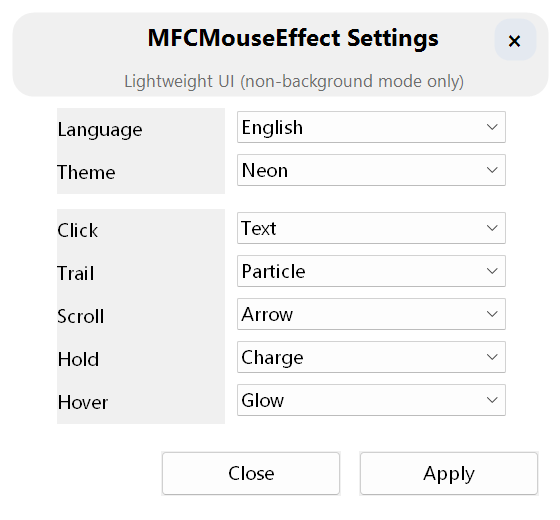

<p align="center">
  
</p>

<h1 align="center">MFCMouseEffect</h1>

<p align="center">
  <b>Make every click, drag, and scroll visible.</b><br>
  Cross-platform desktop input feedback engine · Extensible · Plugin-powered · WASM-ready
</p>

<p align="center">
  <a href="https://github.com/sqmw/MFCMouseEffect/stargazers"></a>
  <a href="https://github.com/sqmw/MFCMouseEffect/releases/latest"></a>
  <a href="https://github.com/sqmw/MFCMouseEffect/blob/main/LICENSE"></a>
  
</p>

<p align="center">
  <a href="https://github.com/sqmw/MFCMouseEffect/releases">📦 Download</a> ·
  <a href="./docs/README.md">📖 Docs</a> ·
  <a href="https://github.com/sqmw/MFCMouseEffect/issues">🐛 Issues</a> ·
  <a href="#-contributing">🤝 Contributing</a> ·
  <a href="https://github.com/sqmw/MFCMouseEffect">⭐ Star</a>
</p>

<p align="center">
  <a href="README.md"><b>🇨🇳 中文</b></a> | <b>🇬🇧 English</b>
</p>

---

<p align="center">
  
</p>

<p align="center"><i>Mouse Companion — more than an effect demo, also an important long-term capability direction for the project</i></p>

## ✨ Why Choose MFCMouseEffect

- 🎯 **Five Independent Effect Lanes** — Click, trail, scroll, hold, hover — each is a separate capability surface, not a skin swap
- 🔌 **WASM Plugin Runtime** — Write your own effects and indicators in WASM; the host controls rendering boundaries, plugins handle logic only
- ⌨️ **Input Indicator** — Visualize mouse clicks, wheel direction, keyboard combos like `Cmd+Tab` and `W+ x3` at a glance
- 🤖 **Automation Mapping** — Map mouse actions, wheel inputs, and gestures to shortcut injection — not just eye candy, real productivity
- 🐾 **Mouse Companion** — Plugin-first Mouse Companion route: a cross-platform desktop pet that follows your cursor
- 🌐 **Unified Settings** — Shared Web settings UI across platforms — single config path, synchronized state, tunable and recoverable

> Great for screen recording, tutorials, and live demos. Also great for developers who want bounded WASM extensibility inside a C++ host.

## 🖼️ Effect Preview

<table>
  <tr>
    <td align="center"><br><b>Click Ripple</b></td>
    <td align="center"><br><b>Particle Trail</b></td>
    <td align="center"><br><b>Scroll Feedback</b></td>
  </tr>
  <tr>
    <td align="center"><br><b>Hold Charge</b></td>
    <td align="center"><br><b>Hover Glow</b></td>
    <td align="center"><br><b>Mouse Companion</b></td>
  </tr>
</table>

<p align="center">
  
</p>
<p align="center"><i>Unified Web Settings UI — shared across platforms, everything in one place</i></p>

## ⌨️ Input Indicator & Automation

<table>
  <tr>
    <td align="center"><br><b>Input Indicator</b></td>
    <td align="center"><br><b>Automation Mapping</b></td>
  </tr>
</table>

- **Input Indicator** — Show mouse clicks, wheel direction, and keyboard combos together, so signals like `L x2`, `W+ x3`, and `Cmd+Tab` stay obvious in recordings and demos
- **Automation Mapping** — Map mouse actions, wheel input, and gestures to shortcut injection, so the feature goes beyond visual feedback into real workflow automation

<details>
<summary><b>Expand for the best-fit scenarios</b></summary>

- **Screen recording / tutorials / live demos**: viewers can see not only where the cursor is, but also what you clicked, switched, or triggered
- **Productivity tools / desktop enhancement**: gestures and input mapping are not just decorative layers, they can participate in real interaction flows

</details>

## 🤝 Contributing

**The project is actively growing — there are many directions waiting for you!**

| Area | Description | Entry Point |
|:---|:---|:---|
| 🎨 **New Visual Effects** | Design new click, trail, hover styles | [Effect Docs](./docs/README.md) |
| 🔌 **WASM Plugins** | Write new plugins or improve tooling | [Plugin Template](./examples/wasm-plugin-template/README.md) |
| 🖥️ **Cross-Platform Parity** | Windows / macOS behavior alignment | [Issue Tracker](https://github.com/sqmw/MFCMouseEffect/issues) |
| 🌐 **WebSettings** | Settings UI/UX improvements | [WebUI Source](./MFCMouseEffect/WebUIWorkspace/) |
| 🐾 **Mouse Companion** | Companion animations, interactions & plugins | [Companion Roadmap (Chinese)](./docs/architecture/mouse-companion-plugin-landing-roadmap.zh-CN.md) |
| 📝 **Docs & Testing** | Documentation, self-checks, regression tooling | [Docs](./docs/) |

**Recommended flow:**

1. Open an [Issue](https://github.com/sqmw/MFCMouseEffect/issues) describing your idea
2. Brief discussion to align on direction
3. Submit a PR
4. For larger architecture changes, email first

📮 **Contact:** `ksun22515@gmail.com`

## 🚀 Quick Start

### Windows

```powershell
# Recommended: Open MFCMouseEffect.slnx in Visual Studio 2026, build Release | x64

# Or use the wrapper commands
.\mfx.cmd build            # Default Release | x64
.\mfx.cmd build --shipping  # Lean delivery build
.\mfx.cmd package           # Generate installer
```

### macOS

```bash
./mfx build                       # Build current host only
./mfx build --skip-webui-build    # Skip rebuilding WebUIWorkspace
./mfx run                         # Build and run
./mfx run-no-build                # Run without rebuilding
./mfx run-no-build --seconds 30   # Auto-stop for quick validation
./mfx package                      # Package
```

> ⚠️ macOS requires **Accessibility** and **Input Monitoring** permissions for global input capture.

## 📊 Platform Status

| Platform | Status | Notes |
|:---|:---:|:---|
| **Windows 10+** | ✅ Stable mainline | Most complete capability set, regression compatibility preserved |
| **macOS** | 🔥 Active mainline | Current priority development lane |
| **Linux** | 🔄 Follow lane | Compile gate and contract coverage |

> Current priority: `macOS mainline first`, while keeping Windows behavior regression-free.

<details>
<summary><b>📦 Architecture Highlights (expand)</b></summary>

### Architecture Design

- **Host-owned rendering boundary** — Plugins compute logic; the host owns rendering execution, budget checks, fallback, and resources
- **Clear module layering** — Core / Platform / Server / WebUI / Tools / Docs each have well-defined responsibilities
- **Progressive extensibility** — Built-in effects work, WASM plugins can layer on top, native fallback catches the rest
- **Cross-platform semantic alignment** — Windows and macOS share core semantics and settings surface
- **Built-in observability** — WebSettings, diagnostics, regression scripts, and self-checks were designed together

### WASM Plugin Capabilities

- Separate `effects` and `indicator` surfaces
- Manifest load, reload, import, and export flows
- Budget control, command validation, error codes, and staged diagnostics
- Transient and retained rendering semantics
- Rich command primitives: `spawn_text` / `spawn_image` / `spawn_pulse` / `spawn_polyline` / `spawn_ribbon_strip` / `spawn_glow_batch` and more

**Plugin quick start:**
- Template: [`examples/wasm-plugin-template`](./examples/wasm-plugin-template/README.md)
- Route doc: [`custom-effects-wasm-route.md`](./docs/architecture/custom-effects-wasm-route.md)
- ABI spec: [`wasm-plugin-abi-v3-design.md`](./docs/architecture/wasm-plugin-abi-v3-design.md)

</details>

<details>
<summary><b>📂 Repository Structure (expand)</b></summary>

```text
MFCMouseEffect/
├── MFCMouseEffect/
│   ├── MouseFx/                 # Core engine: effects, automation, wasm, diagnostics, server
│   ├── Platform/                # Windows / macOS / Linux implementations
│   ├── WebUIWorkspace/          # Svelte settings UI source
│   ├── Runtime/                 # Runtime resources and dependencies
│   ├── Assets/                  # Companion and visual assets
│   └── WasmRuntimeBridge/       # WASM runtime bridge layer
├── tools/
│   ├── platform/regression/     # Regression scripts
│   ├── platform/manual/         # Manual and self-check helpers
│   └── docs/                    # Doc routing and governance scripts
├── docs/                        # Architecture, roadmap, workflow, issue docs
├── examples/                    # Examples and templates
└── mfx / mfx.cmd                # Preferred command entrypoints
```

</details>

<details>
<summary><b>❓ FAQ (expand)</b></summary>

### Effects not showing on macOS?

Check system permissions: `Accessibility` + `Input Monitoring`. The runtime degrades gracefully when missing and recovers once permissions are granted.

### Why is GPU not enabled by default on Windows?

Stability — the default is `--no-gpu`. Use `./mfx build --gpu` when you explicitly want the GPU path.

### What's the difference between Shipping and Release?

Shipping keeps the main runtime and WebUI but trims heavy diagnostics and deep test surfaces. Better for delivery.

### Settings revert after Apply?

Many settings are backend-state-driven. If the backend binding didn't succeed, the UI reconciles to the real state. Check manifest paths and lane status first.

### macOS package blocked on first launch?

Current macOS builds are unsigned. Gatekeeper may block first launch — right-click `Open` in Finder to allow it.

</details>

<details>
<summary><b>🧪 Regression & Self-Check (expand)</b></summary>

```bash
# Full POSIX suite
./tools/platform/regression/run-posix-regression-suite.sh --platform auto

# Effects-focused suite
./tools/platform/regression/run-posix-effects-regression-suite.sh --platform auto

# Automation contract suite
./tools/platform/regression/run-posix-core-automation-contract-regression.sh --platform auto

# WASM-focused suite
./tools/platform/regression/run-posix-wasm-regression-suite.sh --platform auto
```

</details>

<details>
<summary><b>📖 Documentation (expand)</b></summary>

- Docs overview: [docs/README.md](./docs/README.md)
- Chinese docs: [docs/README.zh-CN.md](./docs/README.zh-CN.md)
- macOS mainline snapshot: [docs/refactoring/phase-roadmap-macos-m1-status.md](./docs/refactoring/phase-roadmap-macos-m1-status.md)
- P2 capability index: [docs/agent-context/p2-capability-index.md](./docs/agent-context/p2-capability-index.md)

</details>

## 📄 License

This project is released under the [MIT License](./LICENSE). Free to use, modify, and distribute.

---

<p align="center">
  <b>If it helps, please <a href="https://github.com/sqmw/MFCMouseEffect">star ⭐</a></b><br>
  <sub>Share feedback on <a href="https://github.com/sqmw/MFCMouseEffect/issues">Issues</a> and <a href="https://github.com/sqmw/MFCMouseEffect/discussions">Discussions</a></sub>
</p>
