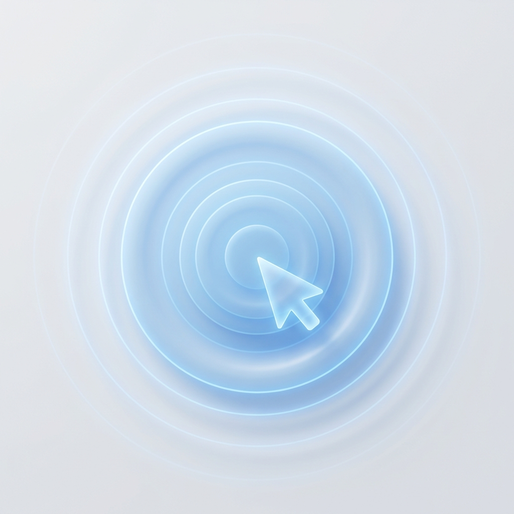
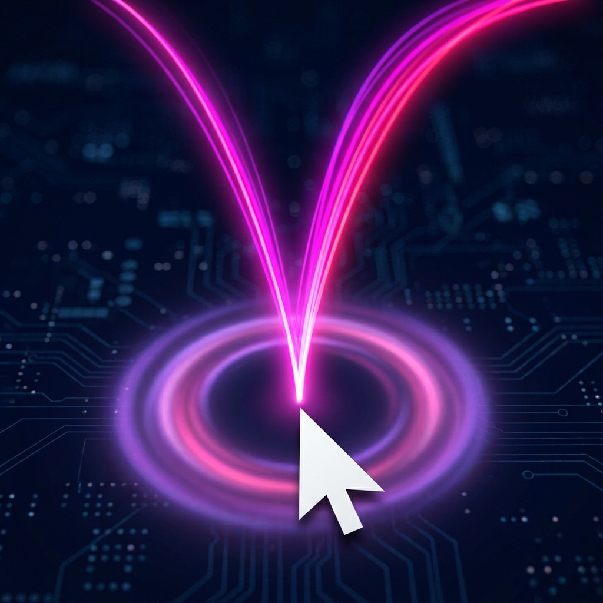
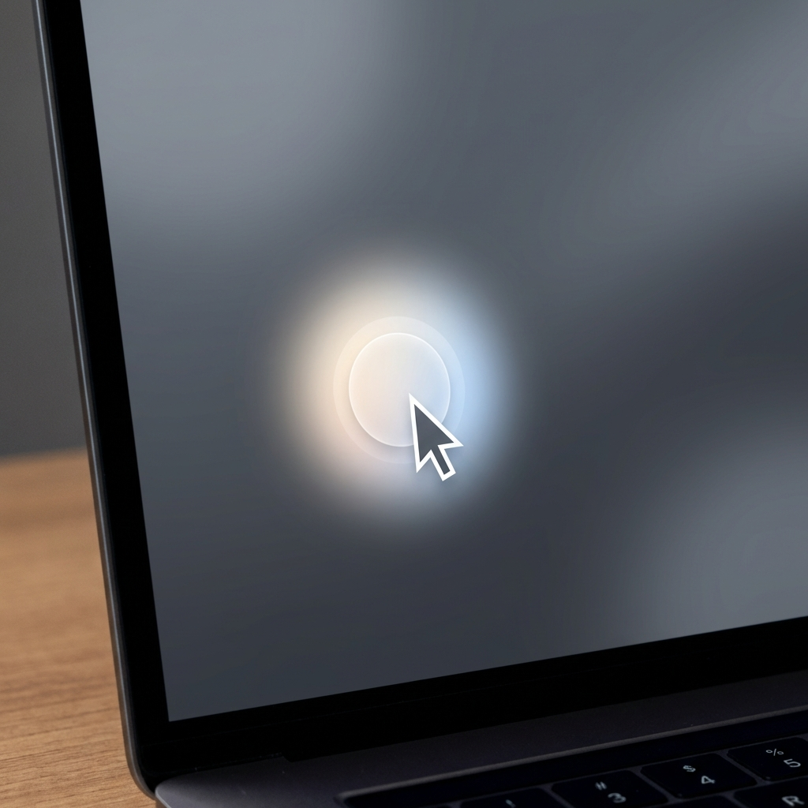
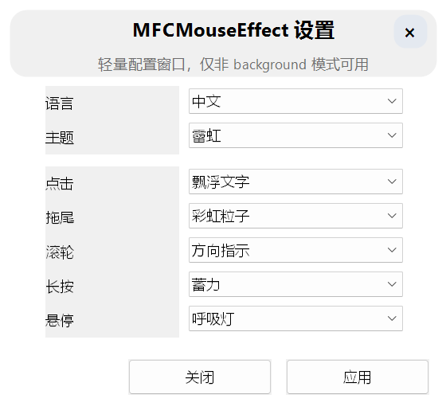

<p align="center">
  
</p>

<h1 align="center">MFCMouseEffect</h1>

<p align="center">
  <b>让每一次点击、拖拽、滚轮都看得见。</b><br>
  跨平台桌面输入反馈引擎 · 可扩展 · 可插件化 · 支持 WASM
</p>

<p align="center">
  <a href="https://github.com/sqmw/MFCMouseEffect/stargazers"></a>
  <a href="https://github.com/sqmw/MFCMouseEffect/releases/latest"></a>
  <a href="https://github.com/sqmw/MFCMouseEffect/blob/main/LICENSE"></a>
  
</p>

<p align="center">
  <a href="https://github.com/sqmw/MFCMouseEffect/releases">📦 下载</a> ·
  <a href="./docs/README.zh-CN.md">📖 文档</a> ·
  <a href="./PRIVACY.zh-CN.md">🔒 隐私政策</a> ·
  <a href="https://github.com/sqmw/MFCMouseEffect/issues">🐛 反馈</a> ·
  <a href="#-参与贡献">🤝 参与贡献</a> ·
  <a href="https://github.com/sqmw/MFCMouseEffect">⭐ Star</a>
</p>

<p align="center">
  <b>🇨🇳 中文</b> | <a href="README.en.md"><b>🇬🇧 English</b></a>
</p>

---

<p align="center">
  
</p>

<p align="center"><i>鼠标伴宠 — 不只是特效展示，也是项目持续演进的重要能力方向</i></p>

## ✨ 为什么选择 MFCMouseEffect

- 🎯 **五条独立效果通道** — 点击、拖尾、滚轮、长按、悬停，不是换皮，而是独立能力面
- 🔌 **WASM 插件运行时** — 用 WASM 编写自己的效果和指示器，宿主控制渲染边界，插件只做逻辑
- ⌨️ **键鼠指示器** — 鼠标点击、滚轮方向、键盘组合键可视化，`Cmd+Tab`、`W+ x3` 一目了然
- 🤖 **自动化映射** — 鼠标动作、滚轮、手势映射到快捷键注入，不只是看起来酷，还有生产力
- 🐾 **鼠标伴宠** — 插件优先的 Mouse Companion 路线，跟随光标的跨平台桌面宠物
- 🌐 **统一设置面** — Web 设置界面跨平台共享，配置路径统一、状态同步、可调可回退

> 适合做录屏、教程、直播演示的创作者，也适合想在 C++ 宿主里引入 WASM 扩展的开发者。

## 🖼️ 效果预览

<table>
  <tr>
    <td align="center"><br><b>点击波纹</b></td>
    <td align="center"><br><b>粒子拖尾</b></td>
    <td align="center"><br><b>滚轮反馈</b></td>
  </tr>
  <tr>
    <td align="center"><br><b>长按蓄力</b></td>
    <td align="center"><br><b>悬停光晕</b></td>
    <td align="center"><br><b>鼠标伴宠</b></td>
  </tr>
</table>

<p align="center">
  
</p>
<p align="center"><i>统一的 Web 设置界面 — 跨平台共享，所有配置一站搞定</i></p>

## ⌨️ 键鼠指示与自动化

<table>
  <tr>
    <td align="center"><br><b>键鼠指示器</b></td>
    <td align="center"><br><b>自动化映射</b></td>
  </tr>
</table>

- **键鼠指示器** — 把鼠标点击、滚轮方向、键盘组合键一起展示出来，`L x2`、`W+ x3`、`Cmd+Tab` 这类信息在录屏和演示里更直观
- **自动化映射** — 支持把鼠标动作、滚轮和手势映射到快捷键注入，让输入反馈进一步进入效率工作流

<details>
<summary><b>展开看这两块更适合哪些场景</b></summary>

- **录屏 / 教程 / 直播**：观众不仅能看到鼠标在哪，也能知道你到底按了什么、切了什么、触发了什么
- **效率工具 / 桌面增强**：手势和输入映射不只是展示层，而是可以进一步参与真实操作流程

</details>

## 🤝 参与贡献

**项目正在积极建设中，有很多方向等你参与！**

| 方向 | 说明 | 入口 |
|:---|:---|:---|
| 🖱️ **鼠标特效** | 点击、拖尾、滚轮、长按、悬停、光标装饰的样式与体验 | [效果文档](./docs/README.zh-CN.md) |
| 🤖 **自动化映射** | 鼠标动作、滚轮、手势到快捷键/命令链的映射能力 | [自动化文档](./docs/automation/automation-mapping-notes.md) |
| ⌨️ **键鼠指示器** | 鼠标、滚轮、键盘组合键的可视化、布局与 WASM indicator | [能力索引](./docs/agent-context/p2-capability-index.md) |
| 🐾 **鼠标伴宠** | 鼠标伴宠动画、交互与插件化 | [鼠标伴宠路线图](./docs/architecture/mouse-companion-plugin-landing-roadmap.zh-CN.md) |
| 🔌 **WASM 插件** | 编写效果 / 指示器插件，或完善 ABI、模板与工具链 | [插件模板](./examples/wasm-plugin-template/README.md) |
| 🌐 **WebSettings** | 设置页体验优化、状态同步与诊断入口 | [WebUI 源码](./MFCMouseEffect/WebUIWorkspace/) |
| 🖥️ **跨平台对齐** | Windows / macOS 行为一致性 | [Issue Tracker](https://github.com/sqmw/MFCMouseEffect/issues) |
| 📝 **文档与测试** | 文档完善、自检脚本、回归工具 | [Docs](./docs/) |

**推荐流程：**

1. 先开一个 [Issue](https://github.com/sqmw/MFCMouseEffect/issues) 说明想法
2. 简单讨论确认方向
3. 提交 PR
4. 大改动或架构讨论，建议先邮件联系

📮 **联系邮箱：** `ksun22515@gmail.com`

## 🚀 快速开始

### Windows

```powershell
# 推荐：Visual Studio 2026 打开 MFCMouseEffect.slnx，Release | x64 编译运行

# 或使用封装命令
.\mfx.cmd build            # 默认 Release | x64
.\mfx.cmd build --shipping  # 精简发行构建
.\mfx.cmd package           # 生成安装包
```

### macOS

```bash
./mfx build                       # 仅编译当前宿主
./mfx build --skip-webui-build    # 跳过 WebUIWorkspace 重编译
./mfx run                         # 编译并启动
./mfx run-no-build                # 跳过编译直接运行
./mfx run-no-build --seconds 30   # 自动退出，快速验证
./mfx package                      # 打包
```

> ⚠️ macOS 需要授予 **Accessibility** 和 **Input Monitoring** 权限才能捕获全局输入。

## 📊 平台状态

| 平台 | 状态 | 说明 |
|:---|:---:|:---|
| **Windows 10+** | ✅ 稳定主线 | 能力最完整，保持兼容回归 |
| **macOS** | 🔥 主开发线 | 当前优先投入方向 |
| **Linux** | 🔄 跟随线 | 编译门禁与合同回归 |

> 当前节奏：`macOS mainline first`，同时要求 Windows 行为不回退。

<details>
<summary><b>📦 核心架构亮点（展开查看）</b></summary>

### 架构设计

- **宿主控制渲染边界** — 插件只做逻辑计算，宿主拥有渲染执行、预算校验、回退与资源控制
- **模块分层清晰** — Core / Platform / Server / WebUI / Tools / Docs 各自职责独立
- **渐进式扩展** — 内建效果可用，WASM 插件可叠加，原生回退可兜底
- **跨平台语义对齐** — Win/mac 共用核心语义与设置面，减少平台行为漂移
- **可观测性内建** — WebSettings、诊断、回归脚本、自检入口是一起设计的

### WASM 插件能力

- 支持 `effects` / `indicator` 双 surface
- manifest 加载、重载、导入、导出
- 预算控制、命令校验、错误码、阶段诊断
- transient 与 retained 两类渲染语义
- 丰富的命令原语：`spawn_text` / `spawn_image` / `spawn_pulse` / `spawn_polyline` / `spawn_ribbon_strip` / `spawn_glow_batch` 等

**插件快速入口：**
- 模板：[`examples/wasm-plugin-template`](./examples/wasm-plugin-template/README.md)
- 路线文档：[`custom-effects-wasm-route.zh-CN.md`](./docs/architecture/custom-effects-wasm-route.zh-CN.md)
- ABI 说明：[`wasm-plugin-abi-v3-design.zh-CN.md`](./docs/architecture/wasm-plugin-abi-v3-design.zh-CN.md)

</details>

<details>
<summary><b>📂 项目结构（展开查看）</b></summary>

```text
MFCMouseEffect/
├── MFCMouseEffect/
│   ├── MouseFx/                 # Core：特效、自动化、WASM、诊断、服务
│   ├── Platform/                # Windows / macOS / Linux 平台实现
│   ├── WebUIWorkspace/          # Svelte 设置页源码
│   ├── Runtime/                 # 运行时资源与依赖
│   ├── Assets/                  # Companion / 视觉资源
│   └── WasmRuntimeBridge/       # WASM 运行时桥接
├── tools/
│   ├── platform/regression/     # 回归脚本
│   ├── platform/manual/         # 手测 / 自检脚本
│   └── docs/                    # 文档索引与治理脚本
├── docs/                        # 架构、路线图、问题、回归文档
├── examples/                    # 示例与模板
└── mfx / mfx.cmd                # 推荐命令入口
```

</details>

<details>
<summary><b>❓ 常见问题（展开查看）</b></summary>

### macOS 看不到效果？

检查系统权限：`Accessibility` + `Input Monitoring`。缺失时会进入 degraded 状态，恢复权限后无需重启。

### Windows 为什么默认不带 GPU？

稳定性考虑，默认 `--no-gpu`。需要 GPU 路线请使用 `./mfx build --gpu`。

### Shipping 和 Release 有什么区别？

Shipping 保留主运行时与 WebUI，但裁掉深度测试和重诊断能力，更适合交付。

### 设置页应用后又恢复了？

很多设置项是后端状态驱动的。如果后端绑定未生效，页面会按真实状态回写。优先检查插件 manifest 路径和 lane 状态。

### macOS 打包后第一次打不开？

当前 macOS 包未签名。可能被 Gatekeeper 拦截，在 Finder 中右键 `Open` 完成首次放行。

</details>

<details>
<summary><b>🧪 回归与自检（展开查看）</b></summary>

```bash
# 全量 POSIX 套件
./tools/platform/regression/run-posix-regression-suite.sh --platform auto

# Effects 聚焦回归
./tools/platform/regression/run-posix-effects-regression-suite.sh --platform auto

# Automation 合同回归
./tools/platform/regression/run-posix-core-automation-contract-regression.sh --platform auto

# WASM 聚焦回归
./tools/platform/regression/run-posix-wasm-regression-suite.sh --platform auto
```

</details>

<details>
<summary><b>📖 文档入口（展开查看）</b></summary>

- 文档总览：[docs/README.zh-CN.md](./docs/README.zh-CN.md)
- English docs：[docs/README.md](./docs/README.md)
- 隐私政策：[PRIVACY.zh-CN.md](./PRIVACY.zh-CN.md)
- Privacy Policy：[PRIVACY.md](./PRIVACY.md)
- macOS 主线快照：[docs/refactoring/phase-roadmap-macos-m1-status.md](./docs/refactoring/phase-roadmap-macos-m1-status.md)
- P2 能力索引：[docs/agent-context/p2-capability-index.md](./docs/agent-context/p2-capability-index.md)

</details>

## 📄 开源协议

本项目基于 [MIT License](./LICENSE) 开源。你可以自由使用、修改和分发，但请保留协议与版权声明。

隐私说明见：[隐私政策](./PRIVACY.zh-CN.md)。

---

<p align="center">
  <b>觉得有用？请点个 <a href="https://github.com/sqmw/MFCMouseEffect">Star ⭐</a></b><br>
  <sub>也欢迎在 <a href="https://github.com/sqmw/MFCMouseEffect/issues">Issues</a> 和 <a href="https://github.com/sqmw/MFCMouseEffect/discussions">Discussions</a> 留言反馈</sub>
</p>
