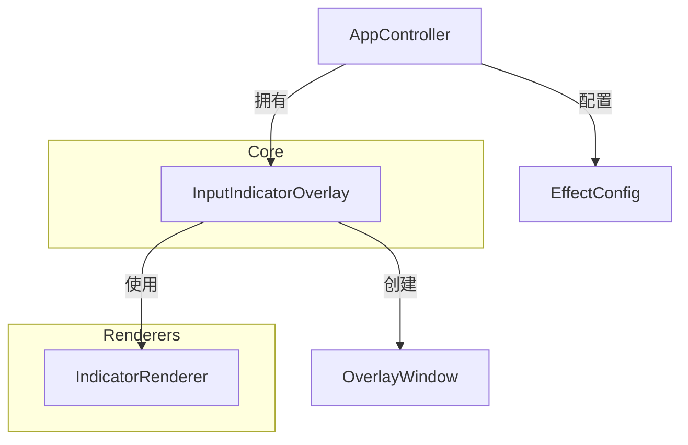

# 输入指示器重构与功能增强 (Input Indicator Refactor)

## 概述

本次重构旨在将原有的 `MouseActionIndicator` 升级为通用的 `InputIndicatorOverlay`，以支持键盘操作显示，并改进鼠标操作的视觉反馈。同时进行了架构调整，将渲染逻辑分离，并确保了配置的向后兼容性。

## 主要变更

### 1. 类与文件重命名
- `MouseActionIndicator` -> `InputIndicatorOverlay`
- 文件：`MouseFx/Core/MouseActionIndicator.h/.cpp` -> `MouseFx/Core/InputIndicatorOverlay.h/.cpp`
- 此更名反映了该组件现在不仅处理鼠标输入，也处理键盘输入。

### 2. 渲染逻辑分离
- 新增 `IndicatorRenderer` 类（`MouseFx/Renderers/Indicator/IndicatorRenderer.h/.cpp`）。
- 将具体的 GDI+ 绘图逻辑从 Overlay 类中剥离，使 Overlay 类专注于窗口管理、定时器和事件处理。
- `IndicatorRenderer` 提供了 `RenderPointerAction`（原 `RenderMouseAction`）和 `RenderKeyAction` 两个主要接口。

### 3. 功能增强

#### 键盘显示
- 支持显示普通按键和组合键（如 `Ctrl+C`, `Win+E`）。
- 逻辑：
  - 单独按下修饰键（Ctrl, Alt, Shift, Win）时不显示，直到按下非修饰键。
  - 组合键格式化为 `修饰键+按键` 字符串。
  - 使用圆角矩形背景 + 文字标签的视觉样式。

#### 鼠标视觉改进
- **左/右/中键**：增加了点击涟漪（Ripple）动画效果，区分单击、双击、三击（通过圆环数量或颜色强度区分）。
- **滚轮**：增加了拖尾箭头动画，区分向上和向下滚动。增加了滚动次数计数显示（如 "W+ 3"）。

### 4. 配置更新与兼容性
- **JSON 配置键**：由 `mouse_indicator` 更新为 `input_indicator`。
- **C++ 配置结构体**：`MouseIndicatorConfig` 重命名为 `InputIndicatorConfig`。
- **向后兼容**：
  - 在加载配置时 (`EffectConfig::Load`)，优先读取 `input_indicator`。如果不存在，尝试读取 `mouse_indicator` 并自动迁移。
  - Web 设置接口 (`AppController::HandleCommand`) 同时支持新旧键名，确保旧版前端或 API 调用的兼容性。
  - 保存配置时统一使用 `input_indicator`。

## 架构图示

## 验证与测试

- **编译**：项目在 Visual Studio 2026 (v145) x64 Debug/Release 下编译通过。
- **功能**：
  - 启用/禁用功能：测试通过。
  - 鼠标点击：左/右/中键显示正常，涟漪动画流畅。
  - 滚轮：向上/向下滚动箭头显示正常，计数准确。
  - 键盘：普通按键、组合键显示正常。
  - 设置持久化：修改配置后重启，配置能正确加载（新旧键名兼容）。

## Web设置页更新
- 前端 `index.html` 和 `app.js` 已更新，所有 ID 和 变量名从 `mi_` (Mouse Indicator) 迁移至 `ii_` (Input Indicator)。
- 国际化（I18N）文本已更新。

## Per-Monitor 位置覆盖

### 功能说明
- 支持为每个显示器独立设置指示器的绝对坐标位置
- 每个显示器有独立的 `enabled` 开关，只有启用的覆盖才会生效
- 后端通过 `PerMonitorPosOverride` 结构体（含 `enabled`/`absoluteX`/`absoluteY`）管理

### 前端 UI（Phase 9 重设计）
- **紧凑单行布局**：每个显示器一行 `[☑] 显示器 1 (1920×1080) ★ 主屏  [X] [Y]`
- **友好名称**：使用计算的分辨率替代原始设备路径（`\\.\DISPLAY10`）
- **i18n 完整支持**：所有动态文本均通过 i18n 字典管理
- **新增翻译键**：`label_per_monitor_cfg`、`label_key_display_mode`、`pm_monitor`、`pm_no_monitors`、`pm_primary_badge`

### 多屏同时显示（Multi-Window Clone）
- **目标屏幕**新增 `custom`（自定义多屏）选项
- 选择后可勾选多个屏幕同时显示指示器，每屏独立设置位置
- 后端使用 **Multi-Window Clone 架构**：为每个启用的屏幕创建独立 HWND
- `InputIndicatorOverlay` 新增方法：`CreateCloneWindow`、`TriggerOnEnabledMonitors`、`RenderToWindow`、`UpdateClonePlacement`、`SyncCloneWindows`、`DestroyClones`
- 前端 Per-Monitor UI 仅在 `mode=absolute && target=custom` 时显示

### 简化：移除 Keyboard Follow Mouse（Phase 11）

为降低配置复杂度，移除了 `keyboardFollowMouse` 开关及全部独立键盘定位参数：

| 移除字段 | 说明 |
|---------|------|
| `keyboardFollowMouse` | 开关已无需存在 — 键盘始终跟随鼠标的位置参数 |
| `kbPositionMode` / `kbOffsetX/Y` / `kbAbsoluteX/Y` / `kbTargetMonitor` | 独立键盘定位参数 |
| `kbPerMonitorOverrides` | 独立键盘每屏覆盖 |

**影响范围**：`EffectConfig.h/cpp`、`InputIndicatorOverlay.cpp`（`useKbParams` 分支全部移除）、`AppController.cpp`、`WebSettingsServer.cpp`、`index.html`、`app.js`

**结果**：鼠标和键盘指示器共用同一组位置参数（`positionMode`、`offsetX/Y`、`absoluteX/Y`、`targetMonitor`、`perMonitorOverrides`），UI 更简洁。
